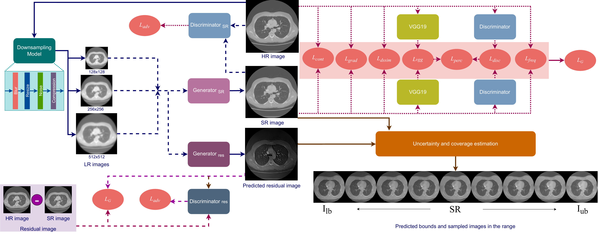

# UncSR: Uncertainty estimation using boundary prediction for medical image super-resolution

The repository contains the implementation of the following paper. \
\
Title - **Uncertainty estimation using boundary prediction for medical image super-resolution** \
Authors - Samiran Dey, Partha Basuchowdhuri, Debasis Mitra, Robin Augustine, Sanjoy Kumar Saha and Tapabrata Chakraborti \
DOI - https://doi.org/10.1016/j.cviu.2025.104349

## Abstract
Medical image super-resolution can be performed by several deep learning frameworks. However, as the safety of each patient is of primary concern, having models with a high degree of population level accuracy is not enough. Instead of a one size fits all approach, there is a need to measure the reliability and trustworthiness of such models from the point of view of personalized healthcare and precision medicine. Hence, in this paper, we propose a novel approach to predict a range of super-resolved (SR) images that any generative super-resolution model may yield for a given low-resolution (LR) image using residual image prediction. Providing multiple images within the suggested lower and upper bound increases the probability of finding an exact match to the high-resolution (HR) image. To further compare models and provide reliability scores, we estimate the coverage and uncertainty of the models and check if coverage can be improved at the cost of increasing uncertainty. Experimental results on lung CT scans from LIDC-IDRI and Radiopedia COVID-19 CT Images Segmentation datasets show that our models, BliMSR and MoMSGAN, provide the best HR and SR coverage at different levels of residual attention with a comparatively lower uncertainty. We believe our model agnostic approach to uncertainty estimation for generative medical imaging is the first of its kind and would help clinicians decide on the trustworthiness of any super-resolution model in a generalized manner while providing alternate SR images with enhanced details for better diagnosis for each individual patient.

\
  </img>

# Getting started

## Installation
To install all requirements execute the following line.
```bash
pip install -r requirements.txt
```
And then clone the repository as follows.
```bash
git clone https://github.com/<your-username>/UncSR.git
cd UncSR
```

## Dataset Preparation
`BliMSR/prepare_data.py` builds the tensor datasets from a folder of DICOM CT volumes, run from inside `BliMSR/`.

Training data — a list of `(hr, lr)` pairs:
```bash
cd BliMSR
python3 prepare_data.py --hr_path HR_image_path --save_path data/train_data.pt --mode train
```
Calibration/test data — a list of `(hr, lr_1, ..., lr_n)` tuples with `n>=1` stochastic LR views per HR image (BliMSR uses `n=3` since its degradation is randomised; a deterministic degradation pipeline can use `n=1`):
```bash
python3 prepare_data.py --hr_path HR_image_path --save_path data/conf_data.pt --mode multiview --n_views 3
python3 prepare_data.py --hr_path HR_image_path --save_path data/test_data.pt --mode multiview --n_views 3
```

## 1. Train the base SR model
Run from inside `BliMSR/`:
```bash
python3 trainer.py --data_path data/train_data.pt --checkpoints_dir checkpoints/
```
Run `python3 trainer.py --help` for all options (batch size, epochs, learning rate, resuming from a checkpoint, device). Pretrained BliMSR weights are available on [Google Drive](https://drive.google.com/file/d/1baxaRC76g0wfdS_w1VYDiX2xDk82rnh1/view?usp=sharing).

## 2. Obtain residuals and train the residual predictor
From the repository root, run the trained base model over the training data to save its per-pixel residual `|hr - sr|` alongside each sample:
```bash
python3 save_residual.py --checkpoint BliMSR/checkpoints/gen_150.pth --data_path BliMSR/data/train_data.pt --save_path BliMSR/data/res_data.pt
```
Then train a residual predictor (same architecture as the base model) to regress this residual directly from the LR input:
```bash
python3 trainer_residual.py --data_path BliMSR/data/res_data.pt --checkpoints_dir BliMSR/checkpoints/
```

## 3. Run conformal prediction to obtain uncertainty and coverage
With both the base model and residual predictor trained, calibrate the conformal quantiles on the calibration set and evaluate coverage and uncertainty on the test set:
```bash
python3 conformal.py \
  --sr_checkpoint BliMSR/checkpoints/gen_150.pth \
  --res_checkpoint BliMSR/checkpoints/gen_res_150.pth \
  --cal_data BliMSR/data/conf_data.pt \
  --test_data BliMSR/data/test_data.pt \
  --alpha 0.1
```
This calibrates `qhat` at full-image, patch and pixel level for the permissible error rate `alpha`, then reports marginal coverage, conditional coverage and mean uncertainty (prediction-interval width) at each level, logged to `BliMSR/checkpoints/conformal/conformal_log.txt`.

# Using UncSR with any other model
`save_residual.py`, `trainer_residual.py` and `conformal.py` are model-agnostic: they only require a generator with a `forward(lr) -> sr` interface returning an image in `[0, 1]` of the same spatial size as `hr`. Point them at your own model with command-line flags — no code changes needed:
```bash
# step 2, on your own trained model
python3 save_residual.py \
  --generator_module MyModel.generator --generator_class Generator \
  --checkpoint MyModel/checkpoints/gen_final.pth \
  --data_path MyModel/data/train_data.pt --save_path MyModel/data/res_data.pt

python3 trainer_residual.py \
  --generator_module MyModel.generator --generator_class Generator \
  --discriminator_module MyModel.discriminator --discriminator_class Discriminator \
  --feature_extractor_module MyModel.feature_extractor --feature_extractor_class FeatureExtractor \
  --data_path MyModel/data/res_data.pt --checkpoints_dir MyModel/checkpoints/

# step 3
python3 conformal.py \
  --sr_generator_module MyModel.generator --sr_generator_class Generator --sr_checkpoint MyModel/checkpoints/gen_final.pth \
  --res_generator_module MyModel.generator --res_generator_class Generator --res_checkpoint MyModel/checkpoints/gen_res_final.pth \
  --cal_data MyModel/data/conf_data.pt --test_data MyModel/data/test_data.pt --alpha 0.1
```
`--generator_module`/`--discriminator_module`/`--feature_extractor_module` are Python import paths (e.g. `MyModel.generator` for `MyModel/generator.py`, which needs a `MyModel/__init__.py`), resolved with the repository root on `sys.path`. Run any script with `--help` to see all options.

# Acknowledgements
[BliMSR](https://github.com/Samiran-Dey/BliMSR)

# Citation
```bash
Dey, S., Basuchowdhuri, P., Mitra, D., Augustine, R., Saha, S.K., Chakraborti, T. (2025). Uncertainty estimation using boundary prediction for medical image super-resolution. Computer Vision and Image Understanding, 256, 104349. https://doi.org/10.1016/j.cviu.2025.104349
```

```bash
@article{Dey2025,
  title = {Uncertainty estimation using boundary prediction for medical image super-resolution},
  journal = {Computer Vision and Image Understanding},
  volume = {256},
  pages = {104349},
  year = {2025},
  issn = {1077-3142},
  doi = {10.1016/j.cviu.2025.104349},
  author = {Samiran Dey and Partha Basuchowdhuri and Debasis Mitra and Robin Augustine and Sanjoy Kumar Saha and Tapabrata Chakraborti}
}
```
## License and Usage
ⓒ Samiran Dey. The models and associated code are released under the CC-BY-NC-ND 4.0 license and may only be used for non-commercial, academic research purposes with proper attribution.
